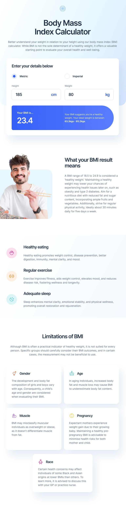

## Table of contents

- [Table of contents](#table-of-contents)
- [Overview](#overview)
  - [The challenge](#the-challenge)
  - [Screenshots](#screenshots)
    - [Destop view](#destop-view)
    - [Tablet View](#tablet-view)
    - [Mobile View](#mobile-view)
  - [Links](#links)
- [My process](#my-process)
  - [Built with](#built-with)
  - [What is next?](#what-is-next)
- [Author](#author)
- [Acknowledgments](#acknowledgments)

## Overview

### The challenge

Users should be able to:

- Select whether they want to use metric or imperial units
- Enter their height and weight
- See their BMI result, with their weight classification and healthy weight range
- View the optimal layout for the interface depending on their device's screen size
- See hover and focus states for all interactive elements on the page

### Screenshots

#### Destop view

#### Tablet View

#### Mobile View

### Links

- Solution URL: [github BMI-calculator](https://github.com/ShubhamOulkar/BMI-calculator)

- Live Site URL: [BMI-calculator](https://frontend-shubhamoulkars-projects.vercel.app/BMI-calculator/)

## My process

### Built with

- Semantic HTML5 markup
- CSS custom properties
- Flexbox
- CSS Grid
- Desktop-first workflow

### What is next?

- [ ] Performance improvement
- [ ] Progressive Web App

## Author

- GitHub: [ShubhamOulkar](https://github.com/ShubhamOulkar)
- Frontend Mentor - [@shubhamoulkar]](https://www.frontendmentor.io/profile/ShubhamOulkar)
- Email: [oulkarshubhu@gmail.com](mailto:oulkarshubhu@gmail.com)

## Acknowledgments

- [Frontend Mentor](https://www.frontendmentor.io)
