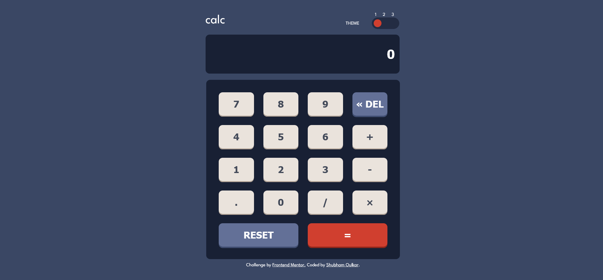

# Calculator app

## Table of contents

- [Calculator app](#calculator-app)
  - [Table of contents](#table-of-contents)
  - [Overview](#overview)
    - [The challenge](#the-challenge)
    - [Screenshot](#screenshot)
    - [Links](#links)
  - [My process](#my-process)
    - [Built with](#built-with)
    - [What I learned ?](#what-i-learned-)
    - [Continued development](#continued-development)
  - [Author](#author)

## Overview

### The challenge

Users should be able to:

- See the size of the elements adjust based on their device's screen size
- Perform mathmatical operations like addition, subtraction, multiplication, and division
- Adjust the color theme based on their preference
- **Bonus**: Have their initial theme preference checked using `prefers-color-scheme` and have any additional changes saved in the browser

### Screenshot

### Links

- Solution URL: [live](https://deluxe-melba-839030.netlify.app/)
- Live Site URL: [github](https://github.com/ShubhamOulkar/frontend/tree/main/calculator-app)

## My process

### Built with

- CSS custom properties
- Flexbox
- CSS Grid
- Mobile-first workflow
- [React](https://react.dev/) - JS library

### What I learned ?

- 1. I used createContext(), useContext(), useState() react hooks for designing three step theme toggler.
- 2. localStorage to store and update theme.
- 3. This toggle btn is a unique component which uses checkbox three states to toggle. (checked, unchecked, indeterminate)
- 4. Calculation logic implemented by using useReducer() and eval() js function.
- 5. Basic sanitation are performed on calculations.
     - remove sequential repeating arithmatic operators (logic written in reducer)
     - remove '×' with asterics '\*' (sanitization function)
     - removing operators if they are present in last position
     - removing '\*' and '/' operators if they are present at start
     - removing ',' commans while evaluation
- 6. Writing calculation logic using useReducer, help me writing modular code structure and easy to maintain.
     Adding commas function after evaluation was easy because of useReducer logic.

### Continued development

## Author

- GitHub -[@ShubhamOulkar](https://github.com/ShubhamOulkar)
- Frontend Mentor - [@ShubhamOulkar](https://www.frontendmentor.io/profile/ShubhamOulkar)
- Twitter - [@shubhuoulkar](https://twitter.com/shubhuoulkar)
- LinkedIn - [Shubham oulkar](https://www.linkedin.com/in/shubham-oulkar-372797217/)
