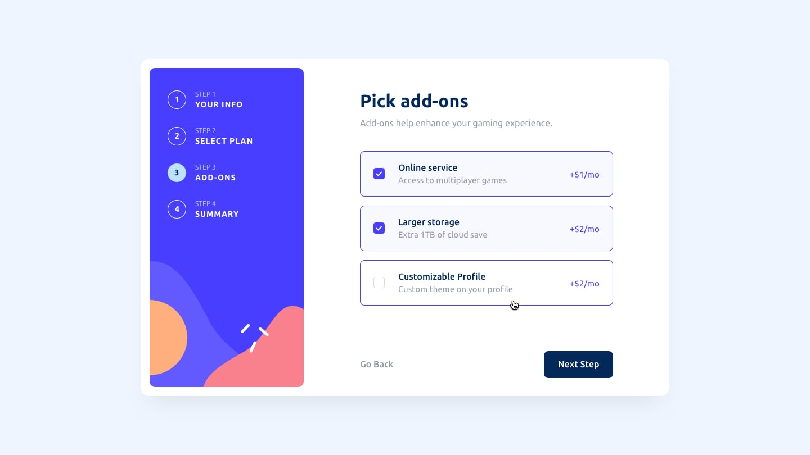

# Frontend Mentor - Multi-step form solution

This is a solution to the [Multi-step form challenge on Frontend Mentor](https://www.frontendmentor.io/challenges/multistep-form-YVAnSdqQBJ). Frontend Mentor challenges help you improve your coding skills by building realistic projects.

## Table of contents

- [Frontend Mentor - Multi-step form solution](#frontend-mentor---multi-step-form-solution)
  - [Table of contents](#table-of-contents)
  - [Overview](#overview)
    - [The challenge](#the-challenge)
    - [Screenshot](#screenshot)
    - [Links](#links)
  - [My process](#my-process)
    - [Built with](#built-with)
    - [What I learned](#what-i-learned)
    - [Continued development](#continued-development)
    - [Useful resources](#useful-resources)
  - [Author](#author)

## Overview

### The challenge

Users should be able to:

- Complete each step of the sequence
- Go back to a previous step to update their selections
- See a summary of their selections on the final step and confirm their order
- View the optimal layout for the interface depending on their device's screen size
- See hover and focus states for all interactive elements on the page
- Receive form validation messages if:
  - A field has been missed
  - The email address is not formatted correctly
  - A step is submitted, but no selection has been made

### Screenshot





### Links

- Solution URL: [Code on github](https://your-solution-url.com)
- Live Site URL: [live site URL](https://your-live-site-url.com)

## My process

### Built with

- Semantic HTML5 markup
- CSS custom properties
- Flexbox
- Desktop-first workflow
- Web components

### What I learned

```html

```

```css

```

```js

```

### Continued development

- [x] Performance optimization
- [x] Prograssive web app

### Useful resources

- [Templates, slots and DOM shadow](https://web.dev/learn/html/template?continue=https%3A%2F%2Fweb.dev%2Flearn%2Fhtml%23article-https%3A%2F%2Fweb.dev%2Flearn%2Fhtml%2Ftemplate) - This helped me for creating web components.
- [MDN Web components](https://developer.mozilla.org/en-US/docs/Web/API/Web_components)

## Author

- GitHub -[@ShubhamOulkar](https://github.com/ShubhamOulkar)
- Frontend Mentor - [@ShubhamOulkar](https://www.frontendmentor.io/profile/ShubhamOulkar)
- Twitter - [@shubhuoulkar](https://twitter.com/shubhuoulkar)
